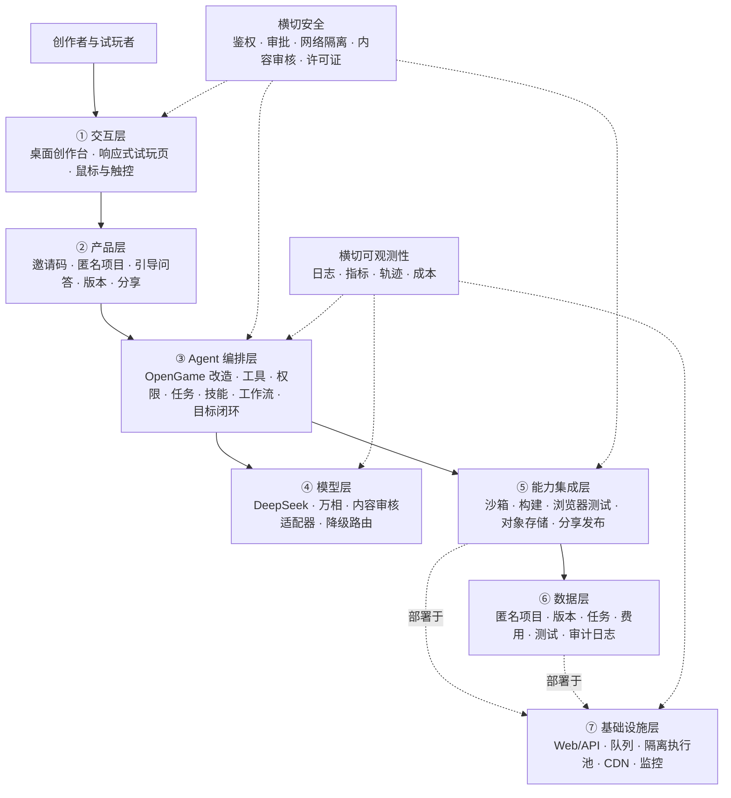

# IfPlay 产品需求文档

版本：MVP v1.0  
日期：2026-10-06  
状态：Stage 0 需求核查完成，进入 Stage 1 技术适配  
产品形态：在线网页产品  
目标市场：中国大陆

## 1. 文档目的

本文档定义 IfPlay v1.0 的产品范围、用户流程、功能需求、Agent 架构、安全边界、数据结构、成本约束和验收标准，可直接用于产品设计、技术设计、开发和测试。

IfPlay v1.0 是独立新项目，不继承旧项目的版本号、代码结构和交付状态。旧项目文档可以作为历史研究材料，但其中的自研运行时、双轨生成和社区规划不自动进入本版本。

## 2. 产品定义

### 2.1 一句话定位

IfPlay 让不会编程的用户通过引导式对话描述游戏想法，并在网页中生成、试玩、连续修改和分享轻量小游戏。

### 2.2 核心价值

- 用户不需要理解代码、游戏引擎或部署流程。
- 系统每次只提出一个容易回答的问题，帮助用户把模糊想法补成可执行需求。
- 生成结果必须可在浏览器完成一轮核心玩法，不能只交付代码或静态画面。
- 用户可以用自然语言连续修改游戏，并预览或恢复最近版本。
- 公开分享前必须完成内容审核和安全检查。

### 2.3 产品目标

v1.0 需要验证一条完整路径。

> 输入想法 → 回答引导问题 → 确认方案 → 生成与检查 → 浏览器试玩 → 连续修改 → 恢复版本 → 审核后分享

首轮目标是证明 IfPlay 能稳定生成多种轻量网页游戏，而非追求大型游戏、完整社区或商业化系统。

### 2.4 非目标

以下内容不进入 v1.0。

- 大型 3D 游戏、开放世界和复杂物理模拟。
- 实时多人、持续联网世界和重度服务端游戏逻辑。
- 用户账户、手机号登录和跨账号资产体系。
- 公开游戏大厅、排行榜、点赞、评论和关注。
- 支付、订阅、充值和创作者分成。
- 视频生成、云端语音生成和复杂动画资产管线。
- 用户生成代码在应用服务器或宿主机上直接执行。

### 2.5 本轮两天交付定义

本轮目标不是正式公开上线，而是在两天内拿到可以完整演示的测试版。

- 第一天跑通后端主链路：创建项目、生成任务、保存版本、修改任务和试玩数据。
- 第二天接通正式前端：从输入想法到生成、试玩和继续修改形成端到端演示。
- 核心链路不允许出现阻断问题。
- 可以暂时存在轻微界面或文案瑕疵，但界面文案、游戏内容和玩法参数必须可继续调整。
- 企业认证、生产级云沙箱、完整内容审核、长期稳定性和正式公开部署属于后续优化，不得在本轮结束时宣称已经完成。

## 3. 目标用户与场景

### 3.1 目标用户

主要用户包括两类。

1. 不会编程，但希望把脑中的玩法快速做成小游戏的普通用户。
2. 需要互动内容、粉丝活动或创意原型的内容创作者。

用户不需要了解提示词工程。产品负责把自然语言想法转换为清晰、有限、可验证的游戏需求。

### 3.2 典型使用场景

- 用户想到一个经营、点击或躲避玩法，希望十分钟内看到可玩的结果。
- 内容创作者把自己的题材改造成一个可以分享的轻量互动游戏。
- 用户试玩后发现节奏、难度、视觉或规则不合适，希望用一句话继续修改。
- 用户对新版本不满意，希望恢复到之前可以正常游玩的版本。

### 3.3 设备定位

- 创作台优先适配电脑网页。
- 生成的游戏必须兼容电脑和手机浏览器。
- 核心操作同时支持鼠标和触控。
- 电脑端和手机端分别验收，单端通过不能宣称双端可用。

## 4. 成功定义与指标

### 4.1 MVP 成功条件

v1.0 同时满足下列条件，才算完成核心验证。

- 用户可以凭有效邀请码进入创作流程。
- 用户通过逐题引导完成一个游戏方案并确认生成。
- 5 个代表性需求中至少 4 个能在 10 分钟内生成可玩结果。
- 成功游戏可以在电脑和手机浏览器完成一轮核心玩法。
- 用户可以连续修改、预览和恢复最近版本。
- 游戏通过自动内容审核后可以生成只读试玩链接。
- 失败任务能说明失败阶段，不覆盖已有可玩版本，也不继续无上限消耗费用。

### 4.2 首轮目标值

下列数值是待真实测试校准的目标，不代表当前已经达到。

| 指标 | v1.0 目标 |
| --- | --- |
| 首轮代表性需求生成成功率 | 5 个需求至少 4 个成功 |
| 初次生成总时长 | 10 分钟以内 |
| 初次生成成本 | 单项目不超过 3 元 |
| 单次自然语言修改成本 | 不超过 1 元 |
| 单项目累计成本 | 不超过 10 元 |
| 自动修复次数 | 每个版本最多 2 轮 |
| 历史版本数量 | 最近 10 个 |
| 匿名项目保留时间 | 默认 7 天 |
| 核心玩法完成率 | 成功游戏均存在至少一条可完成路径 |
| 阻断错误 | 通过验收的版本为 0 个 |

### 4.3 成功游戏的判定

同时满足以下条件，版本才能标记为可玩。

- 项目完成干净构建，入口文件和资源引用完整。
- 页面可以加载、开始、暂停或退出并重新开始。
- 用户能够完成至少一轮核心玩法。
- 游戏存在明确目标，以及失败、结束或阶段完成条件。
- 核心操作在电脑和手机浏览器可用。
- 浏览器自动测试没有发现致命错误、无限加载或阻塞交互。
- 依赖、素材、模型用量、费用、测试和修复记录完整。
- 生成产物没有获得平台账户、密钥、Cookie 或其他项目数据的访问能力。

### 4.4 两天测试版验收标准

- Keiry 可以在测试环境完成一次“输入想法、确认、生成、试玩、提出修改、看到新版本”的完整演示。
- 后端返回的任务阶段、错误和版本信息均来自真实状态，不使用假进度或假成功数据。
- 任何修改失败都不得破坏上一可玩版本。
- 核心链路不存在阻断问题。
- 轻微界面和文案问题可以进入后续清单，但必须能通过配置、内容编辑或自然语言修改继续调整。
- 当前结果明确标记为测试版，不对外承诺正式上线能力。

## 5. 产品范围

### 5.1 支持的游戏范围

v1.0 面向多类型轻量网页游戏，不用固定模板限制用户表达。首轮重点覆盖下列交互类型。

- 经营与资源管理。
- 点击时机与节奏判定。
- 躲避、平台跳跃和轻量闯关。
- 拖拽、合成和简单解谜。
- 剧情选择、数值成长和随机事件。

用户提出超出范围的需求时，系统必须执行以下一种处理。

1. 提供可以在网页中实现的简化方案，并说明删减内容。
2. 请用户调整关键约束后重新确认。
3. 明确拒绝当前无法安全、稳定实现的要求。

### 5.2 素材范围

- 首发文本模型使用 DeepSeek。
- 图片使用阿里云万相，每个初始游戏最多生成 1 至 3 张。
- 普通玩法和数值修改不重复生成图片。
- 用户明确要求改变角色、场景或整体视觉时，才允许再次调用图片模型。
- 图标、按钮、背景纹理和基础特效优先使用程序化绘制、开源素材或项目内置素材。
- 视频和云端音频不进入 v1.0。
- 文本、图片和审核能力必须通过适配器调用，供应商不能写死在产品逻辑中。

## 6. 核心用户流程

### 6.1 进入产品

1. 用户打开 IfPlay 网页。
2. 系统要求输入邀请码。
3. 邀请码有效且仍有额度时，进入创作首页。
4. 邀请码无效、停用或额度不足时，页面说明原因，不进入生成流程。

邀请码只控制测试资格与额度，不作为用户账户。邀请码不得直接充当项目修改凭证。

### 6.2 引导式创作

1. 用户输入一句或一段游戏想法。
2. AI 提取题材、玩家身份、目标、主要动作、操作方式、节奏、难度、视觉风格和目标设备。
3. 信息不足时，系统每次只问一个问题，并提供 2 至 4 个易懂选项和自由输入入口。
4. 已经明确的信息不得重复询问。
5. 系统判断需求是否属于 v1.0 支持范围。
6. 系统生成方案卡，用户可以确认、返回修改或重新推荐。

### 6.3 方案卡

方案卡至少包含以下内容。

- 暂定游戏名称与一句话介绍。
- 玩家身份和最终目标。
- 核心玩法、主要操作和一轮预计时长。
- 成功、失败或阶段完成条件。
- 难度和节奏。
- 视觉方向及预计图片数量。
- 系统做出的简化和当前限制。
- 预计生成时间与费用区间。
- 确认生成、修改方案和放弃三个操作。

用户没有确认方案时，系统不得开始付费生成。

### 6.4 游戏生成

用户确认后，系统创建异步生成任务并依次执行。

1. 固化游戏需求和验收条件。
2. 选择或生成合适的项目模板。
3. 生成代码、文案和必要素材。
4. 在独立云端沙箱安装允许的依赖并构建。
5. 执行静态检查、依赖检查和浏览器自动试玩。
6. 失败时最多自动修复两轮。
7. 通过后保存不可变版本和构建产物。
8. 返回私有试玩页面。

前端只显示真实阶段。不得使用虚假进度条掩盖未知状态。

### 6.5 试玩与连续修改

1. 用户在私有试玩页完成一轮游戏。
2. 用户用自然语言提出修改。
3. 系统说明修改会影响玩法、数值、内容还是视觉，以及预计费用。
4. 用户确认后创建新版本任务。
5. 新版本在独立沙箱中重新构建和测试。
6. 成功后成为当前版本，失败时继续保留原有可玩版本。
7. 用户可以继续修改，直到达到版本、邀请码或项目预算上限。

每个匿名项目最多保留最近 10 个版本。超过上限时删除最旧的非固定版本。当前版本和用户手动固定的一个版本不能被自动删除。

### 6.6 版本恢复

- 历史版本展示创建时间、修改摘要、测试结果和本次费用。
- 用户可以预览任一保留版本。
- 恢复操作通过创建一个指向旧产物的新版本完成，不直接改写历史记录。
- 恢复不调用模型，不计生成费用。

### 6.7 匿名项目与保留时间

- 浏览器保存随机生成的匿名项目凭证。
- 服务端保存项目、任务、版本和费用记录，默认保留 7 天。
- 用户可以通过项目链接在有效期内返回项目。
- 项目链接本身不授予修改权限。修改仍需浏览器中的匿名凭证。
- 用户清除浏览器数据后可能失去修改能力，产品必须提前提示。
- 项目到期前展示剩余时间。v1.0 不提供账户迁移或永久保存。

### 6.8 公开分享

1. 游戏默认私有。
2. 用户主动申请生成试玩链接。
3. 系统执行内容审核、安全检查和分享版本冻结。
4. 审核通过后生成只读试玩链接。
5. 访问者只能试玩，不能查看提示词、源码、历史版本或原项目。
6. 审核失败时游戏保持私有，系统说明风险类别，允许用户修改后重新提交。

v1.0 不提供公开游戏大厅。分享链接可以在项目到期后继续保留多久，由存储成本测试结果决定，默认与匿名项目一同在 7 天后失效。

## 7. 功能需求

### 7.1 邀请与额度

| 编号 | 需求 | 优先级 | 验收条件 |
| --- | --- | --- | --- |
| INV-01 | 输入并校验邀请码 | P0 | 无效、停用和超额状态有明确提示 |
| INV-02 | 邀请码记录初次生成、修改和累计费用 | P0 | 每次任务创建前原子扣减或预占额度 |
| INV-03 | 支持管理员停用邀请码 | P0 | 停用后不能创建新任务，不影响已有游戏试玩 |
| INV-04 | 防止并发请求绕过额度 | P0 | 同一邀请码并发提交不会超发任务 |

具体邀请码数量和单码项目数在首轮测试排期中配置，不写死在客户端。

### 7.2 引导与方案确认

| 编号 | 需求 | 优先级 | 验收条件 |
| --- | --- | --- | --- |
| IDE-01 | 接收中文自然语言游戏想法 | P0 | 支持短句和多段描述 |
| IDE-02 | 每次只询问一个缺失信息 | P0 | 不重复询问已确认信息 |
| IDE-03 | 提供选项与自由输入 | P0 | 用户可以跳过非关键问题 |
| IDE-04 | 判断支持、简化或拒绝 | P0 | 超范围要求不能静默进入生成 |
| IDE-05 | 输出并确认方案卡 | P0 | 未确认前不产生付费生成任务 |

### 7.3 生成任务

| 编号 | 需求 | 优先级 | 验收条件 |
| --- | --- | --- | --- |
| GEN-01 | 创建异步生成任务 | P0 | 刷新页面后仍能恢复任务状态 |
| GEN-02 | 展示真实阶段和最近事件 | P0 | 状态与后端任务记录一致 |
| GEN-03 | 在独立沙箱生成、构建和测试 | P0 | 任务之间文件、网络和进程隔离 |
| GEN-04 | 自动修复失败版本 | P0 | 每个版本最多两轮，达到限制立即停止 |
| GEN-05 | 保存可追溯产物 | P0 | 源码版本、静态产物、日志、依赖和费用可关联 |
| GEN-06 | 生成失败后可理解地降级 | P0 | 显示失败阶段、原因类别和可选操作 |
| GEN-07 | 支持任务取消 | P1 | 取消后终止后续模型和沙箱消费 |

### 7.4 试玩、修改和版本

| 编号 | 需求 | 优先级 | 验收条件 |
| --- | --- | --- | --- |
| VER-01 | 提供私有试玩页 | P0 | 当前版本在支持浏览器可启动和重开 |
| VER-02 | 连续自然语言修改 | P0 | 每次确认后创建新版本，不覆盖旧版本 |
| VER-03 | 保存最近 10 个版本 | P0 | 超限清理符合固定版本保护规则 |
| VER-04 | 预览和恢复版本 | P0 | 恢复不调用模型且历史记录不被改写 |
| VER-05 | 修改失败保护 | P0 | 失败版本不替换当前可玩版本 |
| VER-06 | 修改影响与费用确认 | P0 | 付费调用前展示预计影响和费用上限 |

### 7.5 审核和分享

| 编号 | 需求 | 优先级 | 验收条件 |
| --- | --- | --- | --- |
| SHR-01 | 游戏默认私有 | P0 | 未主动分享的游戏无法通过公开链接访问 |
| SHR-02 | 分享前自动内容审核 | P0 | 审核未通过时不能生成公开链接 |
| SHR-03 | 生成只读试玩链接 | P0 | 访问者无法修改原项目或读取隐私数据 |
| SHR-04 | 冻结分享版本 | P0 | 后续修改不静默改变已分享内容 |
| SHR-05 | 分享链接失效处理 | P1 | 失效页面解释原因，不暴露项目元数据 |

## 8. 状态与异常处理

### 8.1 项目状态

`draft` → `clarifying` → `plan_ready` → `generating` → `private_playable` → `share_review` → `shared`

异常状态包括 `generation_failed`、`review_rejected`、`budget_exhausted`、`expired` 和 `cancelled`。

### 8.2 任务状态

`queued` → `planning` → `coding` → `asset_generation` → `building` → `testing` → `repairing` → `completed`

失败任务必须记录失败阶段、错误类别、修复次数、已花费用和是否存在上一可玩版本。

### 8.3 降级策略

- 文本模型超时后进行有限重试，仍失败则保留任务和已确认方案。
- 图片模型失败时优先使用程序化占位素材，不阻塞玩法验证。
- 自动测试无法完成时，版本不得标记为可玩。
- 自动修复达到两轮后停止，并输出可理解的失败摘要。
- 单次或累计预算达到上限时终止后续付费调用，已有版本继续可用。
- 手机端不兼容时，版本可以标记为“电脑可玩、移动端未通过”，但不能进入正式分享。
- 内容审核服务不可用时默认禁止生成公开链接。

## 9. Agent Harness 设计

### 9.1 五要素建模

| 要素 | IfPlay v1.0 对应内容 |
| --- | --- |
| 工具 | 需求分析、模板选择、代码生成、素材生成、沙箱构建、浏览器测试、内容审核、版本保存和分享发布 |
| 知识 | OpenGame 的 Template Skill 与 Debug Skill、网页游戏交互规范、移动端适配规则、内容安全规则、允许依赖和许可证清单 |
| 观察 | 真实任务状态、构建日志、浏览器错误、游戏状态变化、测试结果、审核结果、模型用量、费用和用户确认 |
| 行动 | 调用模型与供应商 API、创建沙箱、写入项目文件、运行构建测试、保存版本和生成分享链接 |
| 权限 | 付费生成需用户确认；公开分享需审核；沙箱禁止访问平台密钥、账户数据和其他项目；危险依赖默认拒绝 |

### 9.2 组件选型

| 组件 | 决策 | 理由 |
| --- | --- | --- |
| s01 Agent Loop | 必选 | 驱动需求理解、工具调用和修复循环 |
| s02 工具系统 | 必选 | 模型、沙箱、测试、存储和审核都通过受控工具调用 |
| s03 权限系统 | 必选 | 付费、公开分享和生成代码执行都有明确审批与拒绝边界 |
| s04 钩子系统 | 必选 | 在模型调用、沙箱执行、版本保存和分享前后统一记录、检查和限额 |
| s05 任务规划 | 必选 | 生成和修改包含多个可见阶段，需要持久化进度 |
| s06 子 Agent | 暂不新增 | v1.0 复用 OpenGame 内部编排，不额外建设通用子 Agent 平台 |
| s07 技能加载 | 必选 | 按需加载游戏模板、调试规则、设备适配和审核知识 |
| s08 上下文压缩 | 必选 | 连续修改会累积对话和构建日志，需要保留需求与版本摘要并裁剪噪声 |
| s09 记忆系统 | 不选 | v1.0 无账户和长期用户记忆，使用项目状态与版本摘要即可 |
| s10 任务系统 | 必选 | 异步任务需要持久化、恢复、取消和依赖管理 |
| s11 后台任务 | 必选 | 生成最长 10 分钟，不能阻塞网页请求 |
| s12 定时调度 | 不选 | v1.0 没有用户要求的定时生成任务，过期清理由基础设施定时作业处理 |
| s13 Agent 团队 | 不选 | 当前规模不需要常驻多 Agent 团队和独立工作区协作协议 |
| s14 MCP 插件 | 不选 | 首版供应商与内部能力使用直接适配器，减少插件系统复杂度 |
| s15 集成 Harness | 必选 | 权限、任务、技能、上下文和工具必须归一到同一运行时 |
| s16 工作流运行时 | 必选 | 需求确认、生成、构建、测试、修复和发布顺序固定且需要断点恢复 |
| s17 目标闭环 | 必选 | 系统必须依据构建、玩法和设备测试判断何时真正完成 |

## 10. 七层架构



贯穿数据流如下。

用户在交互层输入想法，产品层创建匿名项目；Agent 编排层逐题补全需求并固化方案；模型层生成代码、文案和少量素材；能力集成层在独立沙箱完成构建、测试和修复；通过目标闭环后，数据层保存不可变版本；用户试玩、修改或申请分享，分享前再次经过安全和内容审核。

## 11. 核心工具清单

| 工具 | 输入 | 输出 | 副作用 | 权限 |
| --- | --- | --- | --- | --- |
| `analyze_idea` | 用户描述、已确认答案 | 缺失信息、下一问题、支持范围判断 | 无 | allow |
| `build_game_spec` | 完整问答结果 | 方案卡、验收条件、预算预估 | 无 | allow |
| `generate_game` | 已确认方案、模板、当前版本 | 源码变更和生成记录 | 调用付费模型并写沙箱 | ask |
| `generate_assets` | 视觉方案、图片数量 | 图片与许可证元数据 | 调用付费图片服务 | ask |
| `sandbox_build` | 项目源码、允许依赖、资源限制 | 构建产物、日志、依赖清单 | 在隔离环境执行代码 | allow after policy |
| `browser_test` | 静态产物、测试计划、设备矩阵 | 交互轨迹、截图、错误和判定 | 启动浏览器测试 | allow |
| `repair_version` | 错误摘要、当前源码、剩余预算 | 修复补丁 | 调用模型并重新执行 | allow within confirmed cap |
| `save_version` | 源码哈希、产物、测试和费用 | 不可变版本记录 | 写数据库和对象存储 | allow |
| `restore_version` | 项目凭证、目标版本 | 新的当前版本引用 | 写版本记录 | allow |
| `moderate_share` | 冻结版本、标题、文案、素材 | 通过、拒绝或修改建议 | 调用审核服务 | allow |
| `publish_share` | 审核通过版本 | 只读试玩链接 | 创建公开访问记录 | ask |

所有工具必须具备严格输入结构、超时、统一错误格式、幂等键和审计事件。模型不能直接获得云凭证、数据库连接或沙箱宿主机权限。

## 12. 系统提示词原则

系统提示词由稳定规则、项目状态和按需技能组成，不能把全部历史日志持续塞入上下文。

```text
你是 IfPlay 的游戏创作 Agent。你帮助不会编程的用户把轻量网页游戏想法变成可试玩、可修改和可验证的版本。

规则
1. 信息不足时每次只问一个问题，已经确认的信息不再重复询问。
2. 生成前先给出方案卡、限制、预计时间和费用，得到确认后才能调用付费生成工具。
3. 只处理 v1.0 支持的轻量网页游戏。复杂 3D、实时多人和重度联网需求需要简化或拒绝。
4. 生成代码只能在受控沙箱中构建和测试。测试通过前不得标记为可玩。
5. 修改失败时保留上一可玩版本。每个版本最多修复两轮，并遵守单次与累计预算。
6. 公开分享必须通过内容审核和安全检查。
7. 不编造任务状态、测试结果、费用或已完成功能。

完成条件
构建成功，核心玩法至少存在一条可完成路径，电脑和手机浏览器测试通过，记录完整，且没有阻断错误。

无法继续时
停止新的付费调用，保留现有可玩版本，说明失败阶段、已花费用和用户可以采取的下一步。
```

## 13. 上下文、项目状态与版本策略

### 13.1 会话内上下文

始终保留以下权威信息。

- 用户最初想法与已确认答案。
- 当前方案卡和验收条件。
- 当前版本摘要、固定版本和最近修改意图。
- 预算余额、版本数和修复次数。
- 最近一次构建与测试错误的结构化摘要。

完整构建日志、工具原始输出和旧对话按需读取，不长期放进模型上下文。

### 13.2 跨会话项目状态

v1.0 不建立用户长期记忆。服务端只保存匿名项目继续运行所需的数据，浏览器凭证用于证明修改权限。题材偏好、写作风格和历史行为不跨项目自动复用。

### 13.3 版本不可变

每个成功版本包含源码快照或补丁链、静态产物哈希、依赖清单、素材清单、测试结果、费用记录和创建原因。任何修改都创建新版本，不能原地改写历史版本。

## 14. 数据模型

| 实体 | 关键字段 |
| --- | --- |
| InviteCode | `id`、状态、项目额度、费用额度、到期时间、已用额度 |
| AnonymousProject | `id`、凭证哈希、初始想法、当前状态、当前版本、创建时间、到期时间、累计费用 |
| Clarification | 问题、选项、用户答案、来源、确认时间 |
| GameSpec | 题材、身份、目标、核心玩法、操作、规则、结束条件、视觉、设备、验收条件 |
| GenerationTask | 类型、阶段、状态、幂等键、沙箱、开始结束时间、错误类别、修复次数 |
| GameVersion | 版本号、父版本、修改摘要、源码哈希、产物哈希、测试状态、是否固定、费用 |
| Asset | 类型、供应商、提示词哈希、文件哈希、许可证、所属版本 |
| TestRun | 环境、设备、步骤、结果、错误、截图、轨迹 |
| CostRecord | 模型、版本、输入输出用量、图片数量、单价快照、折算费用、账单核对状态 |
| Share | 冻结版本、审核结果、公开标识、创建时间、失效时间、状态 |
| AuditEvent | 操作者、对象、动作、结果、理由、时间、关联任务 |

匿名凭证只保存安全哈希。模型密钥、供应商密钥和沙箱凭证由服务端密钥管理系统保存，不进入项目数据和日志。

## 15. 安全、隐私与合规

### 15.1 沙箱边界

- 每个任务使用一次性隔离工作区。
- 默认关闭外部网络，只对白名单依赖源和必要模型代理开放受控访问。
- 限制 CPU、内存、磁盘、运行时间、进程数和输出大小。
- 禁止访问宿主机文件、平台环境变量、内部网络、其他用户项目和 Docker 控制接口。
- 依赖必须经过允许列表、许可证记录和漏洞扫描。
- 禁止来源不明的安装脚本和需要高权限的系统调用。
- 试玩使用独立域名或严格沙箱页面，启用 CSP，禁止读取平台 Cookie 和父页面 DOM。

### 15.2 内容审核

分享前审核至少覆盖违法、色情、极端暴力、仇恨、侵权冒用和危险行为。审核模型与规则结果都要保存风险类别，不保存不必要的用户身份信息。

审核服务不可用、结果不确定或命中高风险时默认保持私有。v1.0 不提供人工申诉承诺。

### 15.3 隐私与数据保留

- 收集完成匿名创作、测试和限额所必需的数据。
- 页面明确说明匿名项目默认保留 7 天，以及清除浏览器数据的影响。
- 日志中移除密钥、完整匿名凭证和可直接复用的访问令牌。
- 项目过期后进入清理队列，源码、构建产物、素材和修改凭证按统一策略删除。
- 分享版本的保留规则在公开测试前复核，不能默认为永久保存。
- 提示词、生成代码、图片、日志和用户数据必须在中国大陆境内存储和处理；首版不得接入会导致上述数据跨境处理的服务。

### 15.4 开源与许可证

IfPlay v1.0 基于 [OpenGame](https://github.com/leigest519/OpenGame) 改造。引入或修改其 Apache License 2.0 代码时，必须保留所需版权、许可证和 NOTICE 信息。第三方依赖、字体、图标、音效、图片和模板分别记录来源、版本、许可证和使用范围。

## 16. 成本与额度控制

### 16.1 成本上限

- 初次生成不超过 3 元。
- 每次自然语言修改不超过 1 元。
- 单项目累计不超过 10 元。
- 每个版本最多自动修复两轮。
- 每个初始游戏最多生成 1 至 3 张图片。
- 普通玩法修改不重复生图。
- 测试阶段全部云服务与模型费用合计每月不超过 200 元。
- 首批测试规模为 10 至 20 人，同时生成任务最多 2 个。

### 16.2 执行策略

- 创建任务前预估并预占额度。
- 每次模型和图片调用后记录真实用量与当时单价快照。
- 先完成代码和玩法检查，再生成非必要视觉素材。
- 达到单次、项目或邀请码上限时停止后续付费调用。
- 供应商控制台账单与内部折算必须分开记录，未对账费用不得标记为已结算金额。
- 管理端保留全局熔断开关，可以暂停新生成而不影响已有游戏试玩。

## 17. 可观测性

### 17.1 日志

- 项目、任务、版本和沙箱关联 ID。
- 阶段开始、结束、耗时和结果。
- 工具调用名称、参数摘要、结果摘要和错误类别。
- 权限判断、预算判断、审核结果和版本变更。
- 日志不得包含密钥、完整凭证或原始敏感信息。

### 17.2 指标

- 引导完成率与方案确认率。
- 初次生成成功率和修改成功率。
- 各阶段耗时、排队时间和总时长。
- 构建一次通过率、平均修复轮数和失败原因分布。
- 电脑与手机端核心玩法通过率。
- 单次生成、修改和项目累计成本。
- 内容审核通过率与风险类别分布。
- 版本恢复率、分享申请率和试玩完成率。

### 17.3 轨迹

保存经过脱敏的结构化 Agent 轨迹，用于定位失败、改进模板和评估提示词。轨迹不能作为模型训练数据自动外发，任何后续训练用途需另行确认数据范围和授权。

## 18. 测试与评测

### 18.1 首轮五类需求

首轮至少包含以下五种不同交互形态。

1. 经营与资源管理游戏。
2. 点击时机或节奏判定游戏。
3. 躲避或平台闯关游戏。
4. 拖拽、合成或轻量解谜游戏。
5. 剧情选择、数值成长与随机事件游戏。

具体题材在执行前冻结，防止测试过程中为了通过率临时降低难度。

### 18.2 测试层级

- 单元测试覆盖状态机、额度、版本、凭证和权限判断。
- 契约测试覆盖模型、图片、审核、存储和沙箱适配器。
- 集成测试覆盖生成、构建、测试、修复、保存和分享流程。
- 浏览器测试分别使用电脑视口和真实手机或等效设备。
- 安全测试覆盖越权访问、提示注入、恶意依赖、网络逃逸、密钥泄露和跨项目读取。
- 恢复测试覆盖页面刷新、任务中断、队列重启和沙箱超时。

### 18.3 评测记录

每个代表性需求记录原始输入、问答过程、确认方案、生成产物、版本、测试证据、修复次数、耗时、费用和失败原因。模拟数据与真实模型结果必须分开统计。

## 19. 技术栈与部署建议

以下为 v1.0 推荐方案，技术评审后可以替换实现，但不能降低安全和验收要求。

- 前端使用 TypeScript Web 应用，创作台桌面优先，试玩页响应式适配。
- 后端提供项目、任务、版本、邀请码、审核和分享 API。
- 任务队列承载最长 10 分钟的异步生成，不占用 Web 请求进程。
- OpenGame 作为代码生成与调试能力的基础，在服务端受控编排层中改造。
- 生成任务进入隔离执行池，产物通过对象存储和 CDN 提供试玩。
- 关系数据库保存项目元数据、版本、额度、测试和审计记录。
- 文本、图片和审核供应商通过独立适配器接入。
- 监控覆盖 API、队列、模型、沙箱、对象存储和公开试玩页面。

## 20. 阶段计划

### 第一天：后端演示链路

- 完成新仓库基础工程和 OpenGame 许可证整理。
- 跑通项目创建、任务状态、一次生成、版本保存和一次修改。
- 对 DeepSeek、图片、存储和执行环境建立适配层；未取得正式密钥时允许使用明确标识的开发替身，但不得把模拟结果当成真实模型结果。
- 输出可验证的接口地址、运行步骤、日志和测试证据。

出口条件是后端能够用真实状态完成一条可重复演示的生成与修改流程，失败不会覆盖上一版本。

### 第二天：前端端到端演示

- 完成输入想法、逐题引导、方案确认、生成进度、试玩和继续修改界面。
- 接通第一天的真实后端接口。
- 完成桌面端主流程，并对生成游戏进行基础手机视口检查。
- 由 Keiry 完成最终验收，遗留的非阻断界面和文案问题进入可调整清单。

出口条件是 Keiry 可以独立完成一次端到端演示，核心链路没有阻断问题。

### 后续优化与受限测试

- 补齐正式云沙箱、内容审核、安全测试、成本核对和大陆境内生产部署。
- 完成邀请码、最近 10 个版本、恢复、只读分享和完整移动端适配。
- 执行五类代表性需求评测，目标至少四类通过。
- 企业认证和合规条件明确后，再决定正式公开测试时间。

## 21. 上线验收清单

- [ ] 有效邀请码可以进入创作，无效或超额邀请码被正确拦截。
- [ ] AI 每次只问一个问题，且不会重复询问已确认信息。
- [ ] 用户确认方案前不会产生付费生成任务。
- [ ] 所有生成代码只在独立沙箱内构建和测试。
- [ ] 自动修复最多两轮，失败后有可理解报告。
- [ ] 5 个代表性需求至少 4 个在 10 分钟内生成可玩结果。
- [ ] 初次生成、单次修改和项目累计费用均受硬上限控制。
- [ ] 成功游戏在电脑和手机浏览器完成一轮核心玩法。
- [ ] 用户可以连续修改，并预览或恢复最近 10 个版本。
- [ ] 修改失败不会覆盖上一可玩版本。
- [ ] 匿名项目默认保留 7 天，凭证和到期规则有明确提示。
- [ ] 未审核游戏保持私有，审核通过后才能生成只读分享链接。
- [ ] 分享访问者无法修改项目或读取提示词、源码和历史版本。
- [ ] 日志、轨迹和错误报告不包含密钥及完整匿名凭证。
- [ ] OpenGame 和所有第三方组件的许可证记录完整。
- [ ] 任务、版本、测试、费用和审核记录可以互相追溯。

## 22. 已确认决策

- 产品名称为 IfPlay，PRD 从 v1.0 开始。
- 新项目与旧项目使用不同目录和不同文档，不继承旧版本号。
- 产品为可在线访问的网页产品，首版不做账户系统。
- 目标用户是不会编程的普通用户和内容创作者。
- 创作方式采用逐题引导，每次只问一个问题。
- 支持多类型轻量网页游戏，并明确排除大型 3D、实时多人和重度联网玩法。
- 初次生成目标为 10 分钟以内，5 个代表性需求至少 4 个成功。
- 支持连续多轮自然语言修改，保留最近 10 个版本。
- 匿名云端项目默认保留 7 天。
- 游戏默认私有，用户主动申请并通过审核后生成只读试玩链接。
- 首发使用 DeepSeek 文本模型和阿里云万相图片能力，供应商通过适配器接入。
- 电脑端负责创作，生成游戏兼容电脑和手机浏览器。
- 所有生成代码在独立云端沙箱内构建和测试。
- 初次生成不超过 3 元，单次修改不超过 1 元，单项目累计不超过 10 元。
- 当前交付目标是两天内完成可演示测试版，而非正式公开上线产品。
- 测试期全部服务月度总预算不超过 200 元。
- 首批邀请 10 至 20 人，最多同时执行 2 个生成任务。
- 提示词、生成代码、图片和用户数据必须在中国大陆境内存储和处理。
- 允许存在轻微界面或文案瑕疵，但内容必须可以继续调整，最终由 Keiry 验收。

## 23. 待技术评审确认

以下事项不改变产品方向，但需要在开发排期前由技术评审给出结论。

- 云端沙箱采用自建隔离执行池还是第三方服务，以及中国大陆区域的可用性和单任务成本。
- OpenGame 具体复用范围、需要保留或重写的模块及其 NOTICE 文件处理方式。
- DeepSeek、万相和内容审核服务的具体型号、配额、限流和故障切换方案。
- 匿名项目和分享版本过期后的删除任务、恢复窗口和对象存储生命周期规则。
- 每个邀请码允许创建的项目数与单码费用额度。
- 电脑与手机浏览器的正式兼容矩阵。
- 五个代表性测试需求的完整提示词、成功路径和设备测试步骤。
- 中国大陆公开提供生成式内容服务所需的合规评估、备案与用户协议范围。
- 当前主体能否完成相关云服务企业认证；在答案明确前，只按内部演示和受限测试设计。
